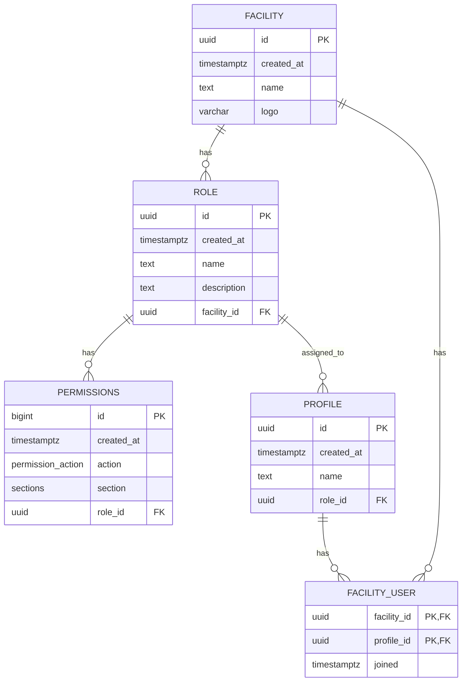

## Database Schema (validated via Supabase)

### Tables

- **facility**
  - Columns: `id uuid PK default gen_random_uuid()`, `created_at timestamptz default now()`, `name text not null`, `logo varchar null`
  - RLS: enabled; SELECT policy: user must belong via `facility_user`

- **facility_user**
  - Columns: `facility_id uuid not null`, `profile_id uuid not null`, `joined timestamptz default now()`
  - Keys: PK (`facility_id`, `profile_id`)
  - FKs: (`facility_id`) → `facility(id)`, (`profile_id`) → `profile(id)`
  - RLS: enabled; SELECT policy: `profile_id = auth.uid()`

- **profile**
  - Columns: `id uuid PK` (FK → `auth.users(id)` ON DELETE CASCADE), `created_at timestamptz default now()`, `name text`, `role_id uuid null`
  - FKs: (`role_id`) → `role(id)` ON DELETE SET NULL
  - RLS: enabled; SELECT policy: can view own profile (`id = auth.uid()`)

- **role**
  - Columns: `id uuid PK default gen_random_uuid()`, `created_at timestamptz default now()`, `name text not null`, `description text`, `facility_id uuid null`
  - Constraints: UNIQUE (`facility_id`, `name`)
  - FKs: (`facility_id`) → `facility(id)`
  - RLS: enabled; policies: SELECT for authenticated; INSERT/UPDATE/DELETE only if user has admin role; RESTRICTIVE delete policy prevents removing `admin`; service_role has full access

- **permissions**
  - Columns: `id bigint PK`, `created_at timestamptz default now()`, `action permission_action not null`, `section sections not null`, `role_id uuid null`
  - FKs: (`role_id`) → `role(id)` ON DELETE CASCADE
  - RLS: enabled; policies: SELECT for authenticated; INSERT/UPDATE/DELETE only if user has admin role

### Enums

- **permission_action**: `read`, `edit`, `delete`, `create`
- **sections**: `permissions`, `users`

### Functions

- `create_role_with_permissions(role_name text, permissions jsonb, facility_id uuid)`
  - Creates a role under a facility and inserts its permissions from JSONB (casts to enums)
- `update_role_with_permissions(role_id uuid, new_role_name text, new_permissions jsonb, permissions_to_delete integer[])`
  - Updates role name, deletes permissions by id, and inserts new ones from JSONB

### Relationships

- `auth.users(id)` → `profile(id)` (1–1)
- `profile(role_id)` → `role(id)` (N–1)
- `role(facility_id)` → `facility(id)` (N–1)
- `permissions(role_id)` → `role(id)` (N–1, cascade on delete)
- `facility_user(facility_id, profile_id)` → `facility(id)`, `profile(id)` (N–M)

### ER Diagram

